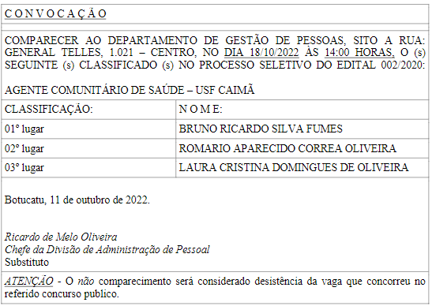

# Listas – Estrutura de Dados em _C_

Material sobre Filas da disciplina de Estrutura de Dados e seus Algoritmos

---

## 📘Listas: Exemplos de  Listas

###  Lista de coisas a fazer

###  Lista de classificação em concurso público

###  Lista de espera em um hospital

###  Lista de compras

## 📘 Tipos de Listas

As listas podem ser representadas de diferentes maneiras, variando conforme a política de inserção e remoção de elementos, a forma de alocação de memória e o tipo de acesso aos dados.

### 🔁 Inserção e Remoção de Elementos

- **Fila (_FIFO_ – _First In, First Out_)**  
  Elementos inseridos no final e removidos do início. Lógica: "primeiro a entrar, primeiro a sair".

- **Pilha (_LIFO_ – _Last In, First Out_)**  
  Elementos inseridos e removidos no final. Lógica: "último a entrar, primeiro a sair".

### 🧠 Tipos de Alocação de Memória

- **Alocação Estática**: memória reservada na compilação. Tamanho fixo.
- **Alocação Dinâmica**: memória alocada em tempo de execução. Lista cresce conforme necessário.

### 📦 Tipos de Acesso aos Elementos

- **Sequencial**: elementos armazenados de forma contínua na memória (ex: array).
- **Encadeado**: cada elemento contém o endereço do próximo.

### 🔧 Operações Básicas de uma Lista

- Criação da lista  
- Inserção de um elemento  
- Remoção de um elemento  
- Busca por um elemento  
- Verificação de tamanho, se está cheia ou vazia  
- Destruição da lista

---
---

## Referências
### Referência Básica:
- Backes, Andre Ricardo. Algoritmos E Estruturas De Dados Em Linguagem C. Ltc - Livros Tecnicos E Cientificos Editora Lda, 2022.
- Ascencio, Ana Fernanda Gomes. Análise de Algoritmos e Estrutura de Dados. Prentice Hall/Sp, 2010.
### Referência Complementar:
- Estruturas de Dados e Seus Algoritmos. Ltc - Livros Tecnicos E Cientificos Editora Lda, 2009.
- Tenenbaum, Aaron M., et al. Estruturas de dados usando C. Pearson Makron Books, 1995.

---

Este material foi elaborado como parte de uma aula prática de estruturas de dados em _C_.
